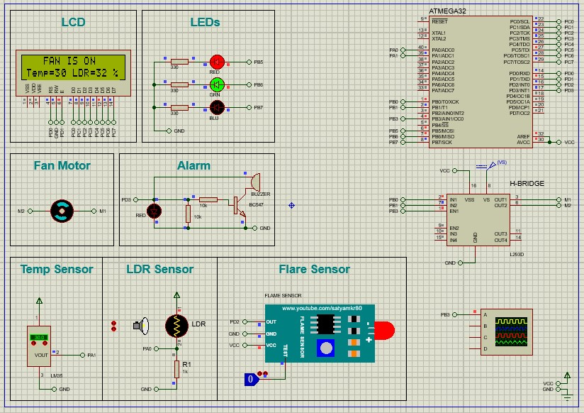

# Smart Home Automation Using ATmega32, LCD, Temperature Sensor, LDR Sensor, Flame Sensor, and Motor Control



## Project Overview

This project is designed to implement a smart home system using the ATmega32 microcontroller, sensors (LM35, LDR, Flame sensor), an LCD display, and a PWM-controlled motor. The system automates lighting and fan speed based on environmental conditions, while also providing safety alerts for fire detection. LEDs are used to indicate varying light intensity levels, and the fan speed is controlled based on room temperature. The LCD provides real-time display of temperature, fan status, light intensity, and fire alerts.

## Key Features

1. **Lighting Control (LDR Sensor)**:
   - Controls three LEDs based on light intensity:
     - **Intensity < 15%**: Red, Green, and Blue LEDs turn ON.
     - **Intensity 16–50%**: Red and Green LEDs turn ON.
     - **Intensity 51–70%**: Only Red LED turns ON.
     - **Intensity > 70%**: All LEDs turn OFF.
   
2. **Fan Speed Control (LM35 Temperature Sensor)**:
   - Automatically adjusts fan speed using PWM based on temperature:
     - **≥ 40°C**: Fan ON at 100%.
     - **35°C ≤ Temp < 40°C**: Fan ON at 75%.
     - **30°C ≤ Temp < 35°C**: Fan ON at 50%.
     - **25°C ≤ Temp < 30°C**: Fan ON at 25%.
     - **< 25°C**: Fan OFF.
   
3. **Fire Detection (Flame Sensor)**:
   - Detects fire, triggers an alarm, and displays "Critical alert!" on the LCD. The system stays in alert mode until the flame is no longer detected.

4. **Real-time LCD Display**:
   - **Row 1**: "FAN is ON" or "FAN is OFF" based on the fan's status.
   - **Row 2**: Displays "Temp= xx°C LDR= xx%" for temperature and light intensity.

## Hardware Components

- **Microcontroller**: ATmega32 (16 MHz)
- **Sensors**:
  - **LDR** (PA0, ADC Channel 0): Light detection
  - **LM35** (PA1, ADC Channel 1): Temperature measurement
  - **Flame Sensor** (PD2): Fire detection
- **LCD Display**: 16x2, 8-bit mode
  - **RS**: PD0, **Enable**: PD1, **Data Pins**: PORTC
- **Motor Control**: H-Bridge for fan motor control
  - **IN1**: PB0, **IN2**: PB1, **Enable1**: PB3 (OC0)
- **LEDs**:
  - **Red**: PB5, **Green**: PB6, **Blue**: PB7
- **Buzzer**: PD3, activated during fire alert

## Drivers and Functions

1. **ADC Driver**: Reads sensor values from LM35 and LDR.
   - `void ADC_init(void)`
   - `uint16 ADC_readChannel(uint8 channel_num)`
   
2. **GPIO Driver**: Configures pin direction for inputs and outputs.
   
3. **PWM Driver**: Controls fan speed using Timer0 in PWM mode.
   - `void PWM_Timer0_Start(uint8 duty_cycle)`
   
4. **LCD Driver**: Displays temperature, light intensity, and alerts.
   
5. **DC Motor Driver**: Controls fan speed and direction.
   - `void DcMotor_Init(void)`
   - `void DcMotor_Rotate(DcMotor_State state, uint8 speed)`
   
6. **LED Driver**: Manages LED states based on light intensity.
   - `void LEDS_init(void)`
   - `void LED_on(LED_ID id)`
   - `void LED_off(LED_ID id)`
   
7. **Flame Sensor Driver**: Detects fire and triggers the alert system.
   - `void FlameSensor_init(void)`
   - `uint8 FlameSensor_getValue(void)`
   
8. **Buzzer Driver**: Activates buzzer during fire detection.
   - `void Buzzer_init(void)`
   - `void Buzzer_on(void)`
   - `void Buzzer_off(void)`

## Folder Structure

- **/src**: Source code (C files, drivers, etc.)
- **/build**: Contains `Makefile`, `main.elf`, `main.hex`
- **/docs**: Documentation and datasheets

## How to Build and Run

1. Clone the repository and navigate to the project root.
2. Use the `Makefile` in the `build` directory to compile:
   ```bash
   cd build
   make
   ```
3. Upload the `main.hex` file to the ATmega32 microcontroller using your preferred programming tool.

## Useful Links

- [Flame Sensor Proteus Library](https://www.mediafire.com/file/cnrdckfrdxun270/Flame-Sensor-Library-For-Proteus-main.zip/file)
- [Project Video](https://youtu.be/Iyj7sOfwYLw)
- [Flame Sensor Video](https://youtu.be/cD3n-Bz7liM)

Thank you for reviewing the project!